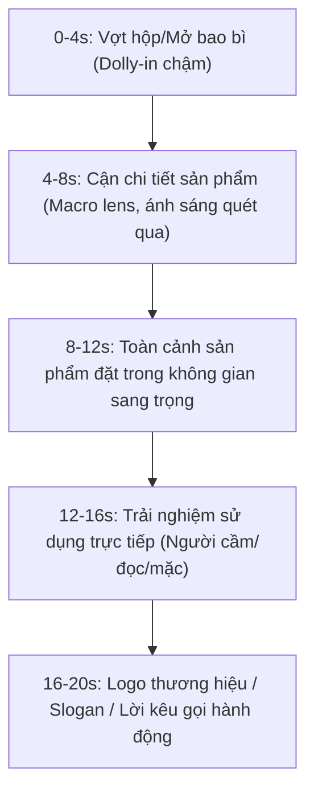

# Cinematic Video Format for Premium Brand

Định dạng video Cinematic tập trung giới thiệu sản phẩm cao cấp, mang tính xây dựng nhận diện thương hiệu mạnh mẽ (brand hype).

## 📊 Cấu Trúc Trực Quan


## 🎥 Cài đặt Prompt mẫu cho Cinematic Product (Hộp/Bao bì/Vật lý)
- **Reference**: Kéo thả 3-5 ảnh sản phẩm thật ở các góc độ khác nhau vào panel reference.
- **Prompt**:
  ```text
  Premium cinematic product shot of the brand package shown in reference images, placed on a dark sleek marble surface. Single moody spotlight sweeping across the product package, highlighting the embossed gold logo and high-end paper texture, minimal dark background, cinematic smoke effect, vertical 9:16, 8k resolution, photorealistic, depth of field.
  LOCK: product logo, typography, package shapes, brand colors.
  ```
- **Kling 3.0 Motion**:
  ```text
  Slow gentle dolly-in and slight tilt up, showing the details of the packaging, luxury warm light sweep.
  ```
- **Lưu ý quan trọng**: Với sản phẩm dạng chai lọ, hộp có logo chữ nhỏ, bắt buộc dùng **Kling 3.0** kèm tính năng **Element Pin** (ghim logo sản phẩm) để tránh AI làm méo chữ khi chuyển động.
