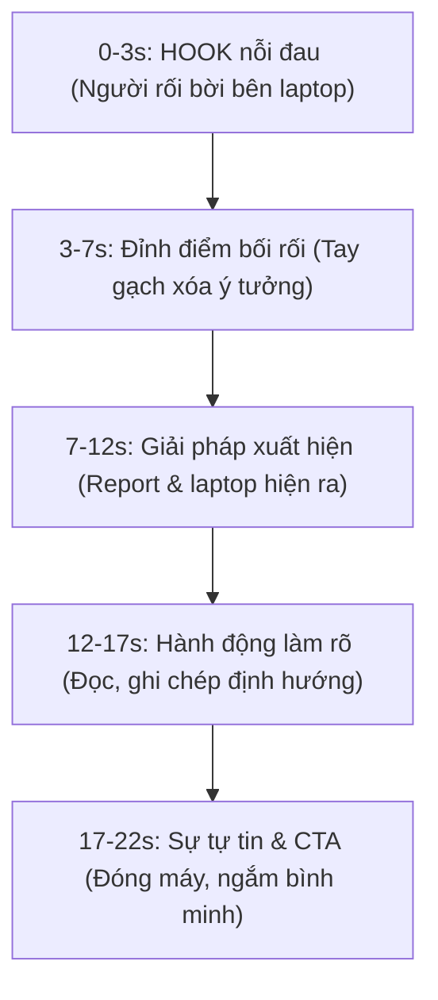

# KOC / Lifestyle Video Format for Reels/TikTok

Định dạng KOC fashion/lifestyle là một trong hai định dạng thắng lớn nhất (high performance) chia sẻ từ workshop KP3. Cấu trúc kịch bản 15-22 giây được thiết kế tối ưu tâm lý giữ chân người xem.

## 📊 Cấu Trúc Trực Quan


## 🎥 Cài đặt Prompt mẫu cho Model thử đồ KOC (Nếu là thời trang/KOC)
Khi ghép mặt model với trang phục:
- **Reference**: 1 ảnh mặt model + 1 ảnh bộ đồ (outfit đã tách nền).
- **Prompt**:
  ```text
  A young female model wearing the outfit shown in reference image, keeping her face EXACTLY the same as reference (lock face, lock skin tone, lock eye color), standing in a bright apartment with natural sunlight through window, casual realistic pose like a real KOC trying on clothes, 9:16 vertical aspect ratio, photorealistic, high detail, natural ambient light, warm tone, shallow depth of field.
  LOCK: face identity, outfit color, outfit design details, embroidery / print / logo on outfit.
  NEGATIVE: wrong face, different person, change outfit color, wrong size, missing buttons, fake plastic look.
  ```
